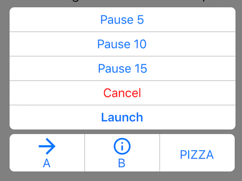

# Using Forms9Patch Button Elements

## Background
I often say Forms9Patch was originally written for the purpose of having NinePatch images in Xamarin.Forms.  That's not completely true.  I wanted NinePatch images because I had used them in Android as the background image for device independent buttons.  Quite frankly,what I really wanted was SVG backgrounds but all the pieces to do that were not available at that time.  Fortunately, things have changed and now - via Forms9Patch - I have both!

Another missing element for Android and Xamarin.Forms is a SegmentedControl (like iOS has). Building a SegmentedControl was a bit painful for me in Android and I dreaded what it would take in Xamarin.  However, when I actually rolled up my sleeves and did it, I fell in love with what the Xamarin team had done.  I was sold!

## Overview

Forms9Patch has three button elements:

- Button
- StateButton¹
- SegmentedControl

All three buttons share a number of properties and behaviors for the purpose of giving you more design and functional options without more complexity.  

### Forms9Patch.Button

`Forms9Patch.Button` is the most basic, adding the following to what `Xamarin.Forms.Button` provides:

- Horizontal and vertical alignment of button's text
- Text and Background color for the selected state
- Outline and clip shape:
  - Rectangle
  - Square
  - Circle
  - Ellipse
  - Obround
- Toggle behavior
- Background image
- Icon as an image or as HTML text
- Icon to text positioning:
  - horizontal vs. vertical orientation
  - icon before or after text
  - spacing between icon and text
- Haptics (when available)

### Forms9Patch.StateButton

`Forms9Patch.StateButton` further extends `Forms9Patch.Button` by adding the ability to toggle its properties as a function of its state.  The states are:

- DefaultState
- PressingState
- SelectedState
- DisabledState
- DisabledAndSelectedState

**NOTE** ¹ : As of Xamarin.Forms 3+, I recommend not using `Forms9Patch.StateButton`.  Rather, use `Forms9Patch.Button` in combination with Xamarin.Forms' new [**Visual State Manager**](https://blog.xamarin.com/xamarin-forms-3-0-released/).  Visual State Manager is a great feature and I'm looking forward to using it!

### Forms9Patch.SegmentedControl

iOS has a segmented control that, for the life of me, I don't know why isn't standard in Android, UWP, or Xamarin.Forms.  It's just too useful.  That being said, if I remember correctly, even the iOS segmented control doesn't support a vertical layout (please correct me if I'm wrong).  

## Using Forms9Patch's buttons

### Layout and Decoration Properties

The layout and decoration properties shared by all three Forms9Patch buttons are:

- Outline:
  - **`BorderRadius`**: 
  - **`BorderWidth`**:  Alternatively, `OutlineWidth`
  - **`BorderColor`**: Alternatively, `OutlineColor`
  - **`HasShadow`**
- Text
  - **`TextColor`**
  - **`SelectedTextColor`**: the color of the button's text when selected
  - **`HorizontalTextAlignment`**
  - **`VerticalTextAlignment`**
- Background
  - **`BackgroundColor`**
  - **`BackgroundImage`**: A `Forms9Patch.Image` that will be used as the button's background.
- Icon:
  - **`TrailingIcon`**: Is the icon before or after the label?
  - **`Orientation`**: Is the icon and label arranged vertically or horizontally?
  - **`TintIcon`**: If the icon is a raster image, should the color of the non-transparent pixels be set to `TextColor`?
  - **`HasTightSpacing`**: If `false`, the icon will be positioned to the outside edge of the button.  If `true`, the icon will be positioned next to the label (separaded by `Spacing`).
  - **`Spacing`**: if `TightSpacing` is true, the icon will be positioned `Spacing` pixels away from the label

  

Additionally, the `Button` and `StateButton` elements have these properties:

- Outline
  - **`ElementShape`**: `ElementShape.Rectangle`, `ElementShape.Square`, `ElementShape.Circle`, `ElementShape.Ellipse`, and `ElementShape.Obround`.  Controls the shape of both the border and the background clipping region.
- Text  
  - **`Text`**: plain text for the button's label
  - **`HtmlText`**: markup text for the button's label - an alternative to `Text`
  - **`LineBreakMode`**: See [Xamarin.Forms.LineBreakMode](https://docs.microsoft.com/en-us/dotnet/api/xamarin.forms.linebreakmode?view=xamarin-forms)
  - **`AutoFit`**: Autofitting algorithm to be applied to button's label's text.  See [Label.Autofitting](Label#utomatically-Resizing-Text-(Auto-fitting)).
- Icon  
  - **`IconImage`**: A `Forms9Patch.Image` element to be used as the button's icon image.
  - **`IconText`**: An alternative to `IconImage`, enabling the use of Unicode characters or special font characters as button icons.  Just like the `HtmlText` property, this property will decode HTML markup, allowing you to specify colors, fonts and other attributes.

