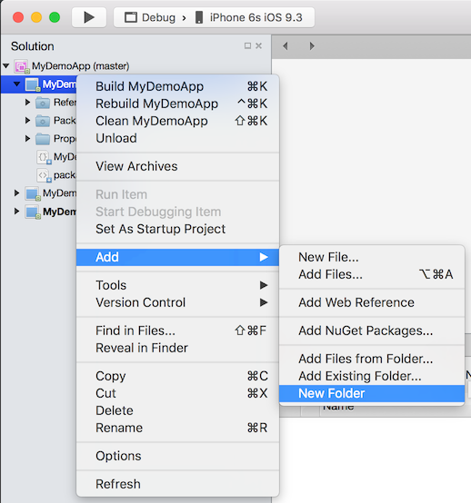
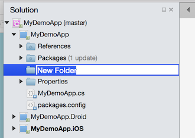
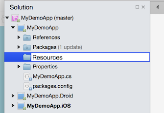
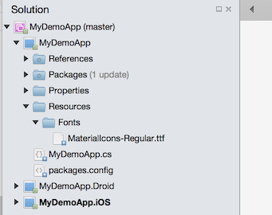

# Forms9Patch Label Element

## Background

I wrote the `Forms9Patch.Label` element to solve a couple of problems:

### EmbeddedResource, Custom Fonts

Setting up to use [custom fonts with Xamarin.Forms](https://xamarinhelp.com/custom-fonts-xamarin-forms/) is very painful - and not at all cross platform.  I wish Xamarin had made using custom fonts easier because I would rather be making apps than making libraries.  But, alas, that's not (yet) the case.   If you're at Xamarin and are reading this, please don't take it personally - I love Xamarin Forms and wouldn't be putting in this much effort if I didn't.

As with images, it seems that the idea cross-platform approach to custom fonts would be to embed them (as EmbeddedResources) in the shared, cross platform code.  That wasn't trivial and there were a lot of obstacles to overcome.  Once worked out, I saw it was possible to bring this font management magic back to Xamarin.Forms elements via the `Forms9Patch.EmbeddedResourceFontEffect`.  

Just to clarify, Forms9Patch text elements (`Label` and buttons) supports EmbeddedResource custom fonts without modification.  Xamarin.Forms text elements (`Label` and `Button`) can also use EmbeddedResource custom fonts by adding the `Forms9Patch.EmbeddedResourceFontEffect` effect.

### Intra-Label Text Formatting

Text formating shouldn't be painful.  That's why HTML and MarkDown was invented.  Although Xamarin uses a fairly conventional approach (intermediate `Span` elements), it certainly isn't an easy approach.  Both iOS and Android have some HTML markup capability, natively.  However, the philosophy behind Forms9Patch is to avoid native if there is a NetStandard, PCL, or Shared Library approach that is easier and just as fast.  

Forms9Patch avoids the use of intermediate elements. Instead, you to pass HTML directly to the `Label` or button elements by way of the `HtmlText` property.  Also, the `HtmlText` property supports a larger range of formatting than Xamarin provides via the Span element. Additionally, `HtmlText` integrates Forms9Patch's Embedded Resource Custom Font support into its HTML markup to give you the power to easily apply custom fonts on a granular level.

### Automatically Resizing Text (Auto-fitting)

Something very important to me is the ability to resize a label's `FontSize` so the label can fit its container without truncation - or having more control over the layout before truncation happens.  At the time of this writing, Xamarin's recommendation for this is "build a custom renderer".  Which is what I did.

Before starting, I reviewed what I already knew: Apple and Android has some provisions for auto-fitting.  But neither addressed all the use cases I've faced.  So, Forms9Patch's Label's auto-fitting had to do more.  Oversimplifying things:

- If the bounds (width and height) of the label are imposed upon it then auto-fitting should scale the font to fit those bounds.
- If the width of the label is imposed upon it then auto-fitting should scale the label's height.

But that is an oversimplification.  The `Lines`, `FontSize`, and `Fit` properties play an important role and determining just how Forms9Patch's auto-fitting works.  To better explain this, lets look at the imposed bounds and imposed width cases separately.

## Examples

## Label with EmbeddedResource, Custom Font

Below is an example of how to use Forms9Patch's custom font management.  The example uses Google's [Material Design Icons font](https://github.com/google/material-design-icons/blob/master/iconfont/MaterialIcons-Regular.ttf), which they have been nice enough to license under the [Creative Common Attribution 4.0 International License (CC-BY 4.0)](http://creativecommons.org/licenses/by/4.0/)!

1. Follow one of the below **Getting Started** guides to create a **.NetStandard** Xamarin Forms cross-platform app with the `MyDemoApp` assembly namespace.  

    - [Getting Started: VisualStudio 2017 for Mac](GettingStartedMac.md)
    - [Getting Started: VisualStudio 2017 for Windows](GettingStartedWindows.md)

2. Create a **Resources** folder in the app's shared code (.NetStandard) project:

    - Right click on your .NetStandard project and select **Add / New Folder**.

      

    - A **New Folder** folder should appear.  Rename it **Resources**.

      | Before | After |
      |--------|-------|
      | |  |

3. Create a **Fonts** folder under the **Resources** folder in the app's shared code (.NetStandard) project

    

4. Save the **MaterialIcons-Regular.ttf** custom font file to the **Resources/Fonts** folder.  I prefer to drag it from OSX Finder or Windows File Explorer into the **Resources/Fonts** folder in VisualStudio.

    

5. Set the **Build Action** to **EmbeddedResource** for this custom font.

    

6. Make note of the Resource ID of this custom font.  See [Embedded Resource Id Naming Convention](ImageSource.md#Embedded-Resource-Id-Naming-Convention) for details.

7. Open your shared source (.NetStandard) application source file (**MyDemoApp.cs** in this example)

8. Change the Label element to a Forms9Patch Label:

    

    Note: The `XAlign` and `YAlign` properties have long ago been deprecated by Xamarin.  As such, I didn't implement them in Forms9Patch.  Use `HorizontalTextAlignment` and `VerticalTextAlignment` instead.

    

9. Set the FontFamily property to the font's EmbeddedResource ID

    

    If you compile and run now, you should see some very unexpected output.  Why? Because the Material Icons doesn't have support for most standard characters!

    

10. Because we're using Material Icons (which is great for symbols but terrible for text), we are going to need to non-latin, unicode characters to our string.  With Forms9Patch, we have some options for specifying unicode characters.  Here are three approaches to getting the label in this example to display the following Material-Icon characters:

    

    **Copy and Paste**

    A lot of times, you can get a Unicode character by copying it from a web page or from an application (like FontBook on OSX).  Once you copy it, you can then paste it into your string in Visual Studio or Xamarin Studio.  For example, here [    ] (between the brackets) are the unicode characters for the Material Icons Font's sissors, airplane, and umbrella characters.

    

    **C# unicode escape code**

    C# makes unicode pretty easy via escape codes ... as long as the character is 16 bit!  For the Material Icons font, you can go to https://design.google.com/icons, select the charactor (icon in this case) you want.  Then, at the bottom right of the page, select **< > ICON FONT**.  There you can find the hexadecimal excape code (see "For IE9 and below").  For the scissors, it is `&#xE14E;`.  For the airplane, is be `&#xE195;`.  And for the umbrella, it is `&#xEB3E;`.  Since each has 4 hexadecimal characters, they all are 16 bit unicode - and I get to avoid explaining how to deal with 32 bit unicode.  In our example, replace `"Welcome to Xamarin Forms"` with `"\uE14E \uE195 \uEB3E"`.  Notice, for each escape code, that the leading `&#` was replaced with `\u` and the trailing semicolon was dropped.

    

    **HtmlText property**

    By design, HTML does a great job with Unicode.  The `HtmlLabel` property wouldn't be useful without that magic.  For this example, remember (above) that the HTML escape codes we found on Google's Material Design Icons page were (Scissors=`&#xE14E;`.  Airplane=`&#xE195;`.  Umbrella=`&#xEB3E;`. ).  Since these are HTML escape codes, we can pass them in a string to the `HtmlText` property.

    

    There is a lot more information about using the `HtmlText` property below.