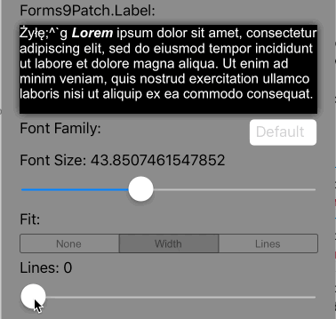
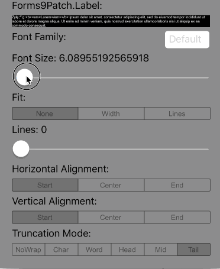
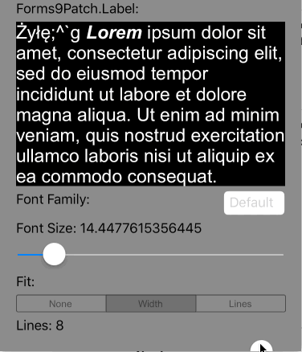
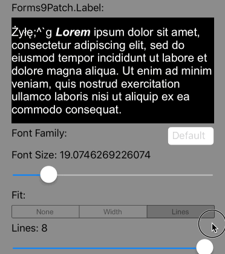
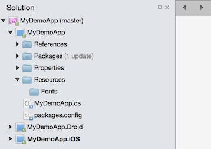
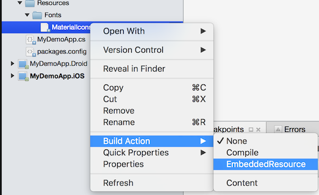
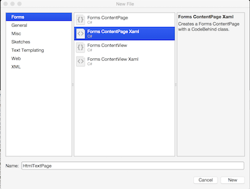
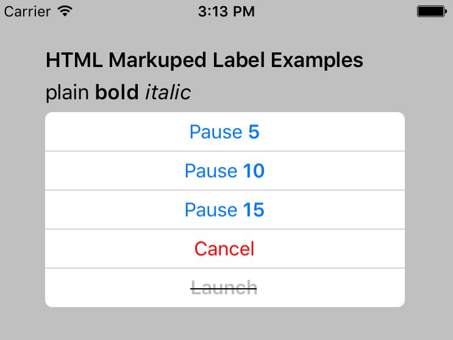

# Forms9Patch Label Element

## Background

I wrote the `Forms9Patch.Label` element to solve a couple of problems:

### EmbeddedResource, Custom Fonts

Setting up to use [custom fonts with Xamarin.Forms](https://xamarinhelp.com/custom-fonts-xamarin-forms/) is very painful - and not at all in the spirit of cross platform.  I wish Xamarin had made using custom fonts easier because I would rather be making apps than making libraries.  But, alas, that's not (yet) the case.   If you're at Xamarin and are reading this, please don't take it personally - I love Xamarin Forms and wouldn't be putting in this much effort if I didn't.

As with images, it seems that the idea cross-platform approach to custom fonts would be to embed them (as EmbeddedResources) in the shared, cross platform code.  That wasn't trivial and there were a lot of obstacles to overcome.  Once worked out, I saw it was possible to bring this font management magic back to Xamarin.Forms elements via the `Forms9Patch.EmbeddedResourceFontEffect`.  

Just to clarify, Forms9Patch text elements (`Label` and buttons) supports EmbeddedResource custom fonts without modification.  Xamarin.Forms text elements (`Label` and `Button`) can also use EmbeddedResource custom fonts by adding the `Forms9Patch.EmbeddedResourceFontEffect` effect.

#### Detailed Examples

- [Adding your custom font as an Embedded Resource](CustomFonts.md#Adding-your-custom-font-as-an-Embedded-Resource)
- [Embedded Resource custom font with Forms9Patch.Label](CustomFonts.md#Embedded-Resource-custom-font-with-Forms9Patch.Label)
- [Embedded Resource custom fonts with Xamarin.Forms text elements + EmbeddedResourceFontEffect](CustomFonts.md#Embedded-Resource-custom-fonts-with-Xamarin.Forms-text-elements-and-EmbeddedResourceFontEffect)

### Intra-Label Text Formatting

Text formating shouldn't be painful.  That's why HTML and MarkDown were invented.  Although Xamarin uses a fairly conventional approach (intermediate `Span` elements), it certainly isn't an easy approach.  Both iOS and Android have some HTML markup capability, natively.  However, the philosophy behind Forms9Patch is to avoid native if there is a NetStandard, PCL, or Shared Library approach that is easier and just as fast.  

Forms9Patch avoids the use of intermediate elements. Instead, you to pass HTML directly to the `Label` or button elements by way of the `HtmlText` property.  Also, the `HtmlText` property supports a larger range of formatting than Xamarin provides via the Span element. Additionally, `HtmlText` integrates Forms9Patch's Embedded Resource Custom Font support into its HTML markup to give you the power to easily apply custom fonts on a granular level.

### Automatically Resizing Text (Auto-fitting)

Something very important to me is the ability to resize a label's `FontSize` so the label can fit its container without truncation - or having more control over the layout before truncation happens.  At the time of this writing, Xamarin's recommendation for this is "build a custom renderer".  Which is what I did.

Before starting, I reviewed what I already knew: Apple and Android has some provisions for auto-fitting.  But neither addressed all the use cases I've faced.  So, Forms9Patch's Label's auto-fitting had to do more.  Oversimplifying things:

- If the bounds (width and height) of the label are imposed upon it then auto-fitting should scale the font to fit those bounds.
- If the width of the label is imposed upon it then auto-fitting should scale the label's height.

But that is an oversimplification.  The `Lines`, `FontSize`, and `AutoFit` properties play an important role and determining just how Forms9Patch's auto-fitting works.  To better explain this, lets look at the imposed bounds and imposed width cases separately.

Once the autofitting is completed, Forms9Patch updates `Label`'s read only `ActualFontSize` property with the resulting font size.  And, in case you were wondering: Why is there no autofitting when the width is not imposed?  Because then the text should all fit on one line.

## Autofit: How it works

Source code for the below examples can be found in [LabelAutofitPage.cs of the Forms9PatchDemo project GitHub repository](https://github.com/baskren/Forms9PatchDemo/blob/master/Source/Pages.Code/LabelAutoFitPage.cs).

### Imposed Bounds Autofitting

So what is meant by **Imposed Bounds**?   If the bounds of the `Label` is either requested (using `WidthRequest` and/or `HeightRequest`) and/or is limited by the bounds of its parent container element (the `Label`'s content is greater than the space available), then Forms9Patch says the `Label`'s bounds is **imposed**. If the `Label'`s bounds are imposed, then you can choose its autofitting behavior using the following property settings:

| Property Setting(s) | Result | GIF |
| ------------------- | ------ | ----|
| `Lines=0` | Scale the font size of the text until it either fits within the bounds, limiting the font size between `MinFontSizeand` and `FontSize`. This is the default setting. |  |
| `Lines>0` `AutoFit=AutoFit.None` | Scale the font size of the text until `Lines` lines fits the Label's `Height`, limiting the font size between `FontSize` and `MinFontSize`.  If the text cannot fit within `Lines` lines or the imposed height, apply the `LineBreakMode` truncation. | |
| `Lines>0` `AutoFit=AutoFit.Width` | Scale the font size of the text until it all fits within `Lines` lines, limiting the font size between `FontSize` and `MinFontSize`.  If limited to `MinFontSize`, apply the `LineBreakMode` truncation. |  |
| `Lines>0` `AutoFit=AutoFit.Lines` | Scale the font size of the text until `Lines` lines fits the Label's Height, limiting the font size between `FontSize` and `MinFontSize`.  If the text cannot fit within `Lines` lines, apply the `LineBreakMode` truncation. |  |

### Imposed Width Autofitting

Autofitting works differently if the `Label`'s width has been imposed but the height has not.  In this scenario, the goal is to scale the height to match text at the given `FontSize` or the given `AutoFit` and `Line` values. The table below describes how imposed width autofitting behavior is controlled by the related property settings:

| Property Setting(s) | Result | GIF |
| ------------------- | ------ | ----|
| `Lines=0` | Scale the height of the `Label` to fit the text at the current `FontSize`. This is the default setting. |  |
| `Lines>0` `AutoFit=AutoFit.None` | Scale the height of the `Label` so that it is as tall as the smaller of either `Lines` lines at `FontSize` or the complete text body at `FontSize`.  If the text cannot fit within `Lines` lines, apply the `LineBreakMode` truncation. |   |
| `Lines>0` `AutoFit=AutoFit.Width` | Scale the height of the `Label` and the font size of the text until it all fits within `Lines` lines, limiting the font size between `FontSize` and `MinFontSize`.  If limited to `MinFontSize`, apply the `LineBreakMode` truncation. |  |
| `Lines>0` `Fit=LabelFit.Lines` | Scale the height of the `Label` so that it is as tall as `Lines` lines at `FontSiz`e.  If the text cannot fit within `Lines` lines, apply the `LineBreakMode` truncation. |  |

## How does Forms9Patch HTML Markup work

Both iOS and Android have some HTML markup capability, natively.  However, the philosophy behind Forms9Patch is to avoid native if there is a NetStandard approach that is easier and just as fast.  Forms9Patch does this by avoiding the use of intermediate classes and, instead, allows you to pass HTML directly to its `Label`, `Segment`, and `Button` elements by way of the `HtmlText` property.  Also, `HtmlText` property supports a larger range of formatting than Xamarin provides via the `Span` element. Additionally, `HtmlText` integrates Forms9Patch's Embedded Resource Custom Font support into its HTML markup to give you the power to easily apply custom fonts on a granular level.

### Supported Tags

- `<a>` Anchor (Action), formatted as a hyperlink.  The text surrounded by this tag will look like a hyperlink.  When this text is tapped on, it will trigger Label's event `EventHandler<ActionTagEventArgs>> ActionTagTapped` event.  The `ActionTagTapped` event will pass object sender (the `Label` element) and `ActionTagEventArgs` e (with, you guessed it, two parameters: `Id` and `Href`).  Attributes:
  - `id` a first string to identify the action
  - `href` a second string to further identify the action
- `<big>` Big
- `<b>` Bold
- `<del>` Delete
- `<den>` Denominator
- `<em>` Emphasis
- `<font>` Font. Attributes:
  - `face`: font family (supports native, "Monospace", "San-serif", "Serif", and Embedded Resource custom fonts)
  - `size`: font size (in "px", "em", and "%" units, HTML 1-7 unit-less, HTML relative, and HTML named sizes )
  - `color`: font color (in RGB, RGBA, HEX, and HTML named colors)
- `<ins>` Insert
- `<i>` Italic
- `<num>` Numerator
- `<pre>` Preformatted (Mono-space font with white space preserved)
- `<s>` Strike-through
- `<small>` Small
- `<strike>` Strike-through
- `<strong>` Strong
- `<sub>` Subscript
- `<sup>` Superscript
- `<tt>` Teletype
- `<u>` Underline

### Attributes

Only the style attribute is supported at this time.

- `style`: Style applied within tag limits. Parameters:
- `background-color`: Background color. (in rgb, rgba, hex, and HTML named colors)
- `color`: Font (foreground) color. (in rgb, rgba, hex, and HTML named colors)
- `font-family`: Font family (supports native, "Monospace", "San-serif", "Serif", and Embedded Resource custom fonts)
- `font-size`: font size (in "px", "em", and "%" units, HTML 1-7 unitless, HTML relative, and HTML named sizes )
- `font-weight`: Set to bold to apply bold to the text.  Only bold is supported at this time and only on fonts there a bold subset is available.  It is recommended to use the `<b>` tag instead.
- `font-style`: Set to italic to apply italics formatting to the text. Only italic is supported at this time and only on fonts where an italic subset is available.  It is recommended to use the `<i>` tag instead.

### XAML Example for HTML Markup

1. Follow one of the below **Getting Started** guides to create a **.NetStandard** Xamarin Forms cross-platform app with the `MyDemoApp` assembly namespace.  

    - [Getting Started: VisualStudio 2017 for Mac](GettingStartedMac.md)
    - [Getting Started: VisualStudio 2017 for Windows](GettingStartedWindows.md)

2. Create a **Resources** folder in the app's shared code (.NetStandard) project:

    - Right click on your .NetStandard project and select **Add / New Folder**.

      

    - A **New Folder** folder should appear.  Rename it **Resources**.

      | Before | After |
      |--------|-------|
      | |  |

3. Create a **Fonts** folder under the **Resources** folder in the app's shared code (.NetStandard) project

    

4. Save the **MaterialIcons-Regular.ttf** custom font file to the **Resources/Fonts** folder.  I prefer to drag it from OSX Finder or Windows File Explorer into the **Resources/Fonts** folder in VisualStudio.

    

5. Set the **Build Action** to **EmbeddedResource** for this custom font.

    

6. Make note of the Resource ID of this custom font.  See [Embedded Resource Id Naming Convention](ImageSource.md#Embedded-Resource-Id-Naming-Convention) for details.

    Your Embedded Resource custom font is now ready for use by Forms9Patch label and button elements and for any Xamarin.Forms.VisualElement that supports the `FontFamily` property.

7. Add a "Forms ContentPage Xaml" file to your .NetStandard project:

   - Right click on your PCL project (MyDemoApp)
   - Select **Add / "New File **

      

      The **New File** dialog box should appear.

   - Select **Forms ContentPage Xaml**, enter a name (*HtmlTextPage*), and click the **[New]** button.

      

      You should now have two new files open in Xamarin Studio: `HtmlTextPage.xaml` (a skeleton Xaml page) and its code behind, `HtmlTextPage.xaml.cs`.

8. Add the `Forms9Patch` namespace to your XAML

   - Open the `HtmlTestPage.xaml` file.
   - Add the `xmlns:f9p="clr-namespace:Forms9Patch;assembly=Forms9Patch"` attribute to the `<ContentPage>` tag.

     

9. Add the XAML Layout

   - Add the `Padding="40` and `BackgroundColor="Silver"` attributes to the `<ContentPage>` tag.
   - Add the following `Forms9Patch.Label` and `Forms9Patch.SegmentedControl` elements to a `Xamarin.Forms.StackLayout` as the `ContentPage`'s content:

        ```xml
        <StackLayout>
            <Label Text="HTML Markup Label Examples" TextColor="Black" FontAttributes="Bold"/>

            <f9p:Label TextColor="Black">
                <![CDATA[plain <b>bold</b> <i>italic</i>]]]>
            </f9p:Label>

            <f9p:SegmentedControl BackgroundColor="White" FontSize="16" FontColor="#0076FF" Orientation="Vertical" OutlineColor="#CCC" OutlineWidth="0" SeparatorWidth="1" OutlineRadius="6" Padding="5">

                <f9p:Segment><![CDATA[Pause <b>5</b>]]></f9p:Segment>
                <f9p:Segment><![CDATA[Pause <b>10</b>]]></f9p:Segment>
                <f9p:Segment><![CDATA[Pause <b>15</b>]]></f9p:Segment>

                <f9p:Segment Text="Cancel" FontColor="Red"/>
                <f9p:Segment HtmlText="&lt;s&gt;Launch&lt;/s&gt;" FontAttributes="Bold" IsEnabled="false">
                    <![CDATA[<s>Launch</s>]]]>
                </f9p:Segment>
            </f9p:SegmentedControl>
        </StackLayout>
        ```

10. Make `HtmlTestPage` your apps MainPage.

    - Open your .NetStandard project's Application subclass (`MyDemoApp.cs` in this example).
    - Set the `MainPage` property to `new HtmlTestPage()`

     

11. Build and start your app

    
