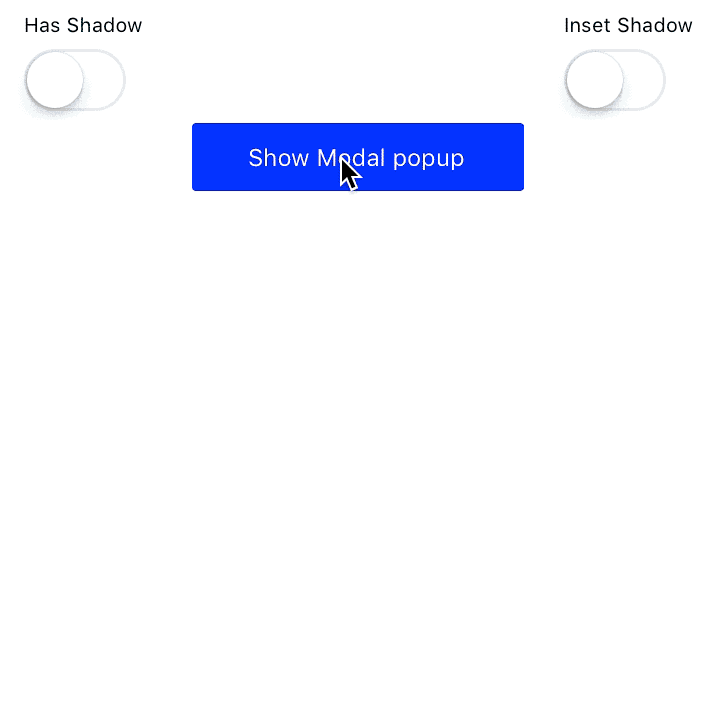
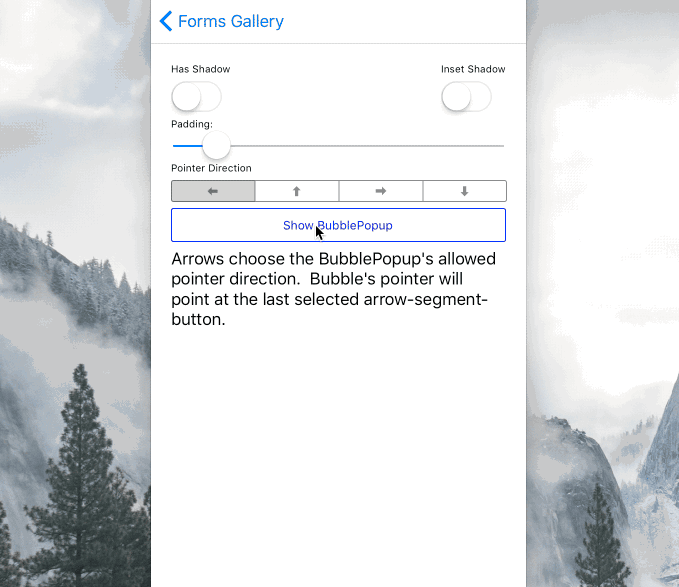
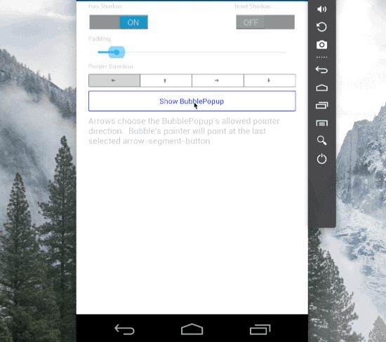

# Forms9Patch Popups

Yet another thing missing from Xamarin Forms is a comprehensive set of popup views.  Forms9Patch has a seven (ModalPopup, BubblePopup, Toast, TargetedToast, PermissionPopup, ActivityInditorPopup and TargetedMenu) popups to simplify the most common tasks.  However, this comes at a price!  In previous releases of Forms9Patch, I tried to implement the popups in a way that would require the least amount of prep work on your part.  Unfortunately, this meant a lot very ugly code, performance penalties, and (to add insult to injury) the Android implementation of version 2.3 of Xamarin.Forms broke it for the `Xamarin.Forms.MasterDetailPage`. 

So, this part is **IMPORTANT!**  Forms9Patch popups only work if your apps `MainPage` is a `Forms9Patch.RootPage`.  Wait, DON'T PANIC!  `Forms9Patch.RootPage` is just a wrapper for your app's pages.  In other words, wrap page content you normally would set as its `MainPage` in an instance of `Forms9Patch.RootPage`. For example, if your app's instance of App is as follows (pay attention to line 25):

**NOTE:**  This is also important.  Forms9Patch popups really don't work consistantly when presented in a descendent of a Page that has been pushed modally.  I'm not sure why this is and just haven't had the time to look into this.  One day!

```csharp
using Xamarin.Forms;

namespace ExampleApp
{
	public class App : Application
	{
		public App()
		{
			// The root page of your application
			var content = new ContentPage
			{
				Title = "ExampleApp",
				Content = new StackLayout
				{
					VerticalOptions = LayoutOptions.Center,
					Children = {
						new Label {
							HorizontalTextAlignment = TextAlignment.Center,
							Text = "Welcome to Xamarin Forms!"
						}
					}
				}
			};

			MainPage = new NavigationPage(content);  // before adding Forms9Patch popup support
		}
	}
}
```

You are going to want to change line 25 to:

```csharp
using Xamarin.Forms;

namespace ExampleApp
{
	public class App : Application
	{
		public App()
		{
			// The root page of your application
			var content = new ContentPage
			{
				Title = "ExampleApp",
				Content = new StackLayout
				{
					VerticalOptions = LayoutOptions.Center,
					Children = {
						new Label {
							HorizontalTextAlignment = TextAlignment.Center,
							Text = "Welcome to Xamarin Forms!"
						}
					}
				}
			};

			MainPage = Forms9Patch.RootPage.Create(new NavigationPage(content)); // after adding Forms9Patch popup support
		}
	}
}
```

## Common Properties, Methods and Events

The following properties and methods are common to all Forms9Patch popups, except `ActivityIndicatorPopup`:

### Appearance Properties
- `BackgroundImage`: The `Forms9Patch.Image` displayed as the popup's background.
- `BackgroundColor`: popup's optional background color. 
- `OutlineColor`: optional outline color.
- `OutlineWidth`: width of optional outline.
- `OutlineRadius`: outline's corner radius.
- `HasShadow`: one more time ... that actually works on Android.  Has no effect when BackgroundColor has not been set.
- `ShadowInverted`: to apply a recessed effect to the layout (if HasShadow is enabled).

### Page Overlay (between the popup and the page the popup sets upon) Properties:
- `PageOverlayColor`: The Color of the page overlay upon which the ModalPopup sets.  Default value is `Color.Rgba(0.5, 0.5, 0.5, 0.5)`.
- `CancelOnBackgroundTouch`: Controls is the popup is cancelled if the background is touched.  Default value is true.

### Memory Management Properties:
- `Retain`: a boolean (default: `false`) used to indicate if the popup and its contents should be removed from the view hierarchy as soon as the view is hidden.  Why would I bother to have this? *ANDROID!* If you have a heavy layout that will be shown multiple times, you may not want to re-render each time it is made visible. Seeing `Retain=true` will keep your popup and its content in the view hierarchy so it won't have to be re-rendered the next time you want to present it.

### Methods
- `void Cancel()`: Programically cancels the Popup.

### Events
- `Cancelled`: Called when the popup has been canceled by the user tapping outside its bounds.


## Forms9Patch.ModelPopup

The most needed missing component: a simple content popup that is a content container which centers its contents on the main page.  Since you may want a popup container with a background image, Forms9Patch provides the ModalPopup element for this purpose.  Once you have initialized a Forms9Patch popup view, set the IsVisible property to true to present it.

### Unique Properties
- `Content`: The `Xamarin.Forms.VisualElement` that will be the content for the popview.  Layouts and Views are fair game.
- `ElementShape`: `ElementShape.Rectangle`, `ElementShape.Square`, `ElementShape.Circle`, `ElementShape.Ellipse`, and `ElementShape.Obround`.  Controls the shape of both the border and the background clipping region.

|  |
|---|

## Forms9Patch.BubblePopup

The popup that is missing from both Xamarin.Forms and Android is a pointer bubble popup - a popup that points to another element.  Given a `Target` element, some `Content` to display, and an allowed `PointerDirection`, `Forms9Patch.BubblePopup` will best fit a popup bubble pointing the the `Target`.  Note that, unlike the `ModalPopup` element, `BubblePopup` does not support the `BackgroundImage` nor `ElementShape` properties.  If you do not specify the `Target`, `BubblePopup` will present its content in a `ModalPopup`.  As with `ModalPopup`, once you have initialized a `BubblePopup` you will need to set the `IsVisible` property to `true` to present it.

### Unique Properties
- `Content`: The `VisualElement` that will be the content for the popview.  Layouts and Views are fair game.
- `Target`: The `Xamarin.Forms.VisualElement` to which the bubble popup will point.
- `PointerLength`: how long is the pointer.
- `PointerTipRadius`: what is the radius of the pointer's tip?
- `PointerDirection`: what directions is the bubble popup allow to point?  Type:`PointerDirection`
- `PointerCornerRadius`: what is the radius of the notch between the bubble's body and the pointer?

|  |  |
| --- | --- |

## Forms9Patch.Toast

Sometimes you simply need to put a message up on the screen.  Given some HTML formatted text and an HTML formatted title `Toast` will display them in a popup with an (optional but enabled by default) **[OK]** button.  `Toast` is inherited from the `ModalPopup` element so it does support background images.  Unlike `ModalPopup`, `Toast` has the `Create(string title, string text)` static method that will generate and present the toast.  You can still manually construct and present a `Toast` by using its constructor and setting its `IsVisible` property to true.

### Unique Properties:
- `Title`: The title for the Toast.  See [HTML Markup](Label#HTML-Markup:-How-it-works) for supported markup.
- `Text`: The text for the Toast.  See [HTML Markup](Label#HTML-Markup:-How-it-works) for supported markup.
- `ElementShape`: `ElementShape.Rectangle`, `ElementShape.Square`, `ElementShape.Circle`, `ElementShape.Ellipse`, and `ElementShape.Obround`.  Controls the shape of both the border and the background clipping region.

### Unique Methods:
- `static Toast Create(string title, string text)`: instantiates and presents a `Toast`.


## Forms9Patch.TargetedToast
Just as `Toast` is a convenience version of `ModalPopup`, `TargetedToast` is a convenience version of `BubblePopup`.  Given a `Target` as a `Xamarin.Forms.VisualElement`, a `Title`, some `Text` to display, and an allowed `PointerDirection`, `Forms9Patch.TargetedToast` will best fit a popup bubble pointing the the `Target`.  Like `BubblePopup` element, `BubblePopup` does not support background images.  If you do not specify the `Target`, it will present itself as a `Toast`.  As with `Toast`, you can use the `Create` static method to instantiate and present a `TargetedToast`.

### Unique Properties:
- `Title`: The title for the Toast.  See [HTML Markup](Label#HTML-Markup:-How-it-works) for supported markup.
- `Text`: The text for the Toast.  See [HTML Markup](Label#HTML-Markup:-How-it-works) for supported markup.
- `Target`: The `Xamarin.Forms.VisualElement` to which the bubble popup will point.
- `OkButtonColor`: Background color for **[OK]** button.
- `OkTextColor`: Text color for **[OK]** button.
- `OKText`: Text for **[OK]** button.  Set to null to remove the **[OK]** button from the popup.  As noted above, you don't want this set to null when `CancelOnBackgroundTouch` is set to `false`.

### Unique Methods
- `static TargetedToast Create(VisualElement target, string title, string text)`: instantiates and presents a `TargetedToast`.

## Forms9Patch.PermissionPopup
Sometimes you simply need to ask a yes/no question.  Given some HTML formatted text and an HTML formatted title, `PermissionPopup` will display them in a popup with **[OK]** and **[Cancel]** buttons.  `PermissionPopup` is inherited from the `ModalPopup` element so it does support background images.  Unlike `ModalPopup`, `PermissionPopup` has the `Create(string title, string text)` static method that will generate and present the toast.  You can still manually construct and present a `PermissionPopup` by using its constructor and setting its `IsVisible` property to `true`.  Unlike `Toast`, the **[OK]** and **[Cancel]** buttons cannot be removed from the layout by setting their text to null.

### Unique Properties
- `Title`: The title for the Toast.  See [HTML Markup](Label#HTML-Markup:-How-it-works) for supported markup.
- `Text`: The text for the Toast.  See [HTML Markup](Label#HTML-Markup:-How-it-works) for supported markup.
- `OkButtonColor`: Background color for **[OK]** button.
- `OkTextColor`: Text color for **[OK]** button.
- `OKText`: Text for **[OK]** button.
- `CancelButtonColor`: Background color for **[Cancel]** button.
- `CancelTextColor`: Text color for **[Cancel]** button.
- `CancelText`: Text for **[Cancel]** button.

### Unique Methods:
- `static PermissionPopup Create(string title, string text, string okText = "OK", string cancelText = "Cancel")`: instantiates and presents a `PermissionPopup`.

### Unique Events:
- `OkTapped`: Called when the **[OK]** button has been tapped.


## Forms9Patch.TargetedMenu
Sometimes you need a popup menu with a list of menu items.  And, if there are more menu items than available room, the menu needs to have pagination.  `Forms9Patch.TargetedMenu` combines `SegmentedController`'s use of a `List<Segement>` to define the menu items with features of `TargetedToast` to give this functionality.

### Unique Properties:
- `Segments`: a `List` of `Forms9Patch.Segement` elements that define the menu items.  See [Forms9Patch.Segment](xref:Forms9Patch.Segment) for how to set a segment's text and icons.
- `FontSize`: size of font to be used.
- `TextColor`: color of text for each menu item.
- `SeparatorColor`: color of separator line between menu items
- `SeparatorWidth`: thickess of separator line between menu items
- `HapticEffect`: if available on platform and enabled via `HapticMode`, what will be the haptic effect: `None`, platform's `KeyClick` effect, platform's `Return` key effect, or platforms `Delete` key effect? 
- `HapticMode`: if available on platform, enable, disable, or use default behaviour for the haptic effect.

### Unique Events:
- `public event SegmentedControlEventHandler SegmentTapped`: fired when a menu item (segment) has been tapped.


## Forms9Patch.ActivityIndicatorPopup
This popup is propably misnamed. Its purpose is to present an activity indicator and block interaction with the app.   Because `ModalPopup` had everything I needed to build this, I named it a popup.  Probably should have thought about that more.  Also, because this is something you typically just want to fire and forget, like `Toast` and `TargetedToast`, `ActivityIndicatorPopup` has a `Create` static method to instantiate and present an instance in one call.

Note that

###  Properties:
- `PageOverlayColor`: The `Color` of the page overlay upon which the `ModalPopup` sets.  Default value is `Color.Rgba(0.5, 0.5, 0.5, 0.5)`.
- `Color`: `Color` of the activity indicator.
- `CancelOnBackgroundTouch`: Controls is the popup is cancelled if the background is touched.  Default value is true.

### Methods
- `static ActivityIndicatorPopup Create()`
- `void Cancel()`: Programically cancels the popup.

### Events
- `Cancelled`: Called when the popup has been canceled by the user tapping outside its bounds.


